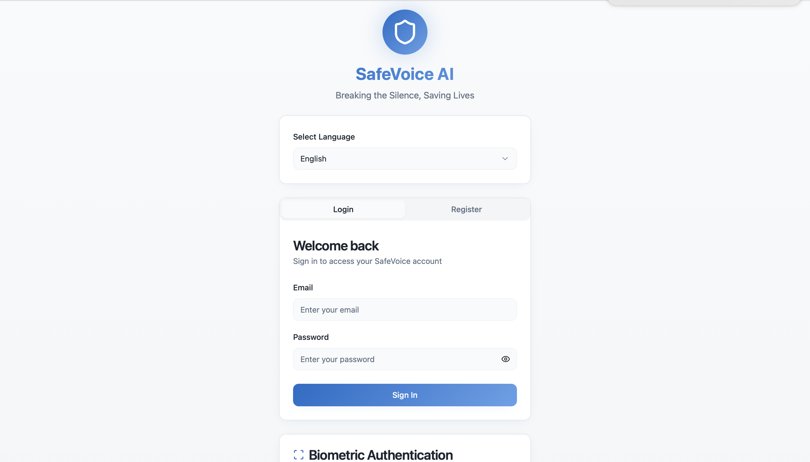
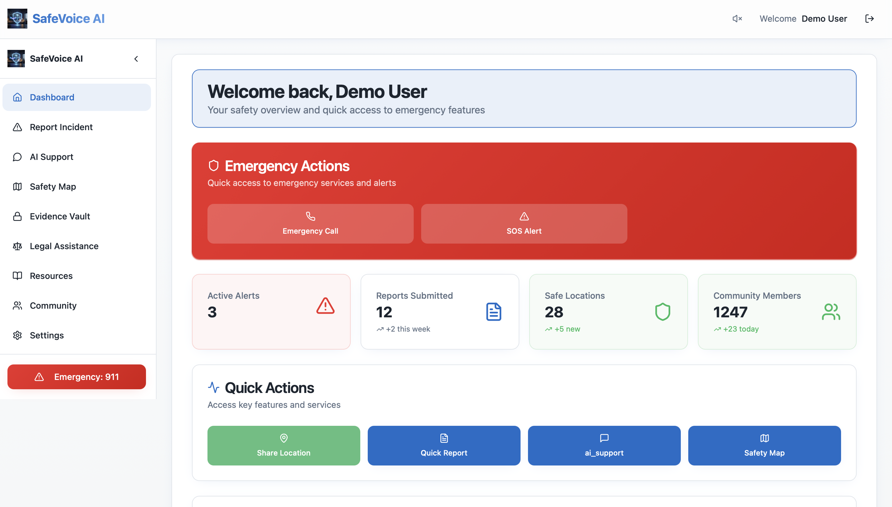
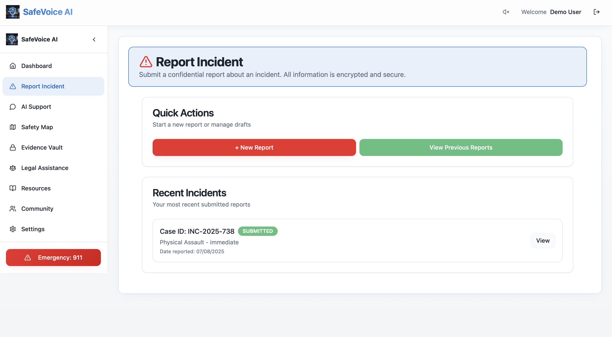
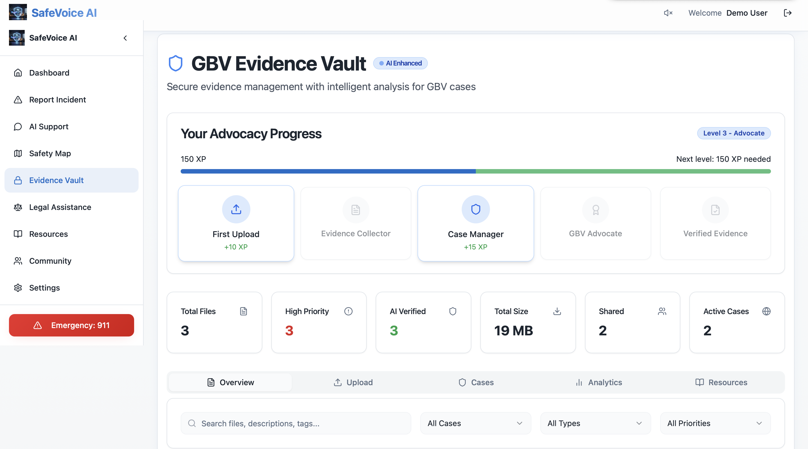
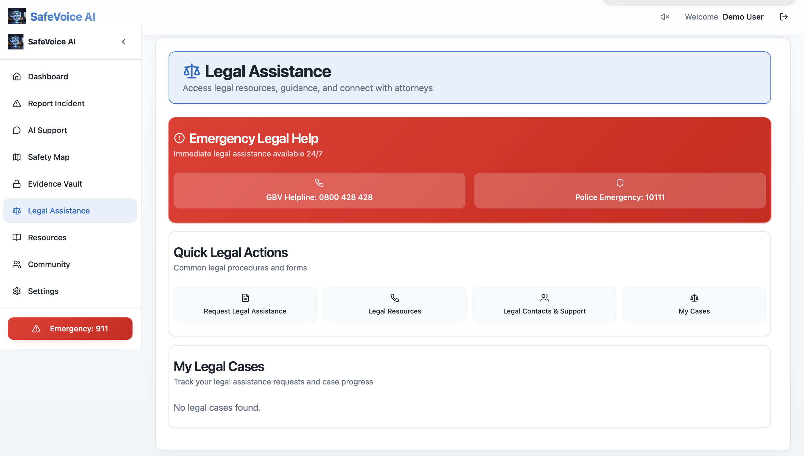
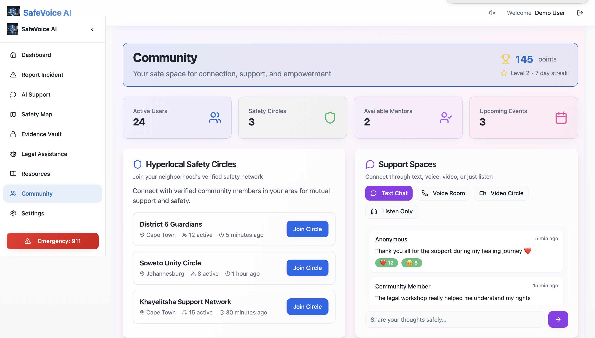
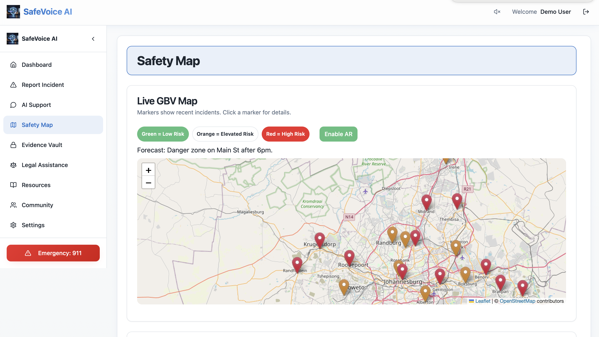
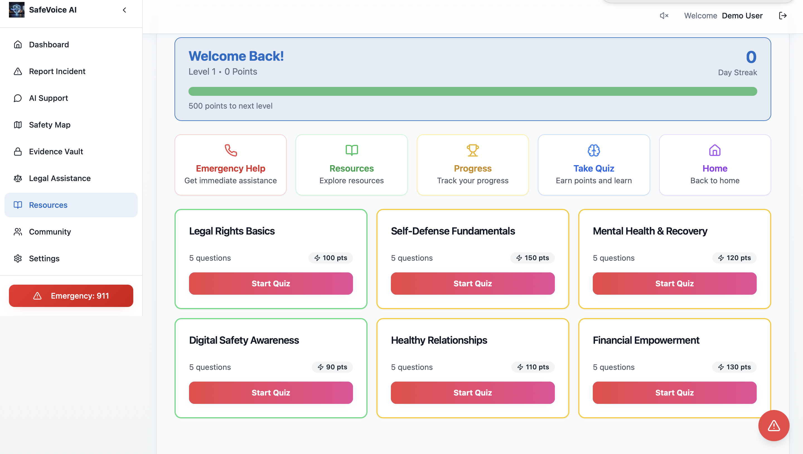

# 🛡️ SafeVoice

**SafeVoice** is a secure, multilingual, and AI-powered web-based platform designed to support individuals in vulnerable situations — offering tools for safety, legal assistance, evidence management, and community engagement.

 <!-- Replace with actual path or URL -->

---

## 🌐 Project Overview

SafeVoice is built using modern web technologies such as **React (TypeScript)**, **Vite**, and **Tailwind CSS** to deliver a responsive, user-friendly experience. It provides users with access to critical features like biometric login, incident reporting, evidence vaults, legal support, USSD offline access, and AI-powered chat.

---

## ✨ Key Features

### 🧑‍💻 1. User Interface

- Modular UI Components: `src/components/ui/`
- Main layout: `SafeVoiceLayout.tsx`
- Navigation Sidebar: `Sidebar.tsx`

---

### 🔐 2. Authentication & Security

- `AuthPage.tsx`: Handles user login and registration
- `BiometricLogin.tsx`: Biometric authentication
- `MFASetup.tsx`: Multi-Factor Authentication setup
- `USSDOfflineModeButton.tsx`: USSD support for offline access

---

### 🗣️ 3. Chat & Community Support

- `AIChat.tsx`: AI-powered chat assistant
- `Community.tsx`: Forum for user interaction and support

---

### 📊 4. Dashboard & Incident Reporting

- `Dashboard.tsx`: Central user dashboard
- `ReportIncident.tsx`: Submit reports with location, description, and media

---

### 🔒 5. Evidence Management

- `EvidenceVault.tsx`: Secure vault for storing evidence (documents, images, audio, etc.)
- `assets/`: PDFs, crime documentation, and protection guides

---

### ⚖️ 6. Legal Assistance

- `LegalAssistance.tsx`: Access legal resources, hotlines, and documentation

---

### 🗺️ 7. Mapping & Safety Tools

- `ARMap.tsx` & `SafetyMap.tsx`: Augmented Reality and Safety maps
- `USSDModal.tsx`: Interactive USSD-based safety features

---

### 🎮 8. Resources & Gamification

- `GBVGamificationPlatform.tsx`: Gamified learning on GBV awareness
- `Resources.tsx`: Educational content, helplines, and guides

---

### ⚙️ 9. Settings & Preferences

- `Settings.tsx`: Manage user preferences including language, theme, and voice features

---

## 🧠 Context Providers & Hooks

- `AuthContext.tsx`, `LanguageContext.tsx`, `VoiceContext.tsx`
- Custom Hooks: `use-mobile.tsx`, `use-toast.ts`
- Utilities: `utils.ts`

---

## 🌍 Routing & Pages

- `index.tsx`: Main landing page
- `NotFound.tsx`: 404 page
- Static HTML: AR demo, presentations, standalone evidence viewer, etc.

---

## ⚙️ Configuration & Build Tools

- **Vite** – Fast bundler: `vite.config.ts`
- **Tailwind CSS** – Utility-first styling: `tailwind.config.ts`
- **TypeScript** – Strong typing: `tsconfig.json`
- **ESLint** – Linting rules and code quality

---

## 📁 Project Structure

```
├── public/
│ ├── favicon.ico
│ ├── logo.png
│ ├── fonts/
│ └── robots.txt
│
├── src/
│ ├── components/
│ ├── pages/
│ ├── contexts/
│ ├── hooks/
│ ├── utils/
│ └── assets/
│
├── tailwind.config.ts
├── vite.config.ts
└── tsconfig.json
```


---

## 💻 Technology Stack

| Tech            | Purpose                                |
|-----------------|----------------------------------------|
| React (TS)      | Frontend framework                     |
| Vite            | Lightning-fast build tool              |
| Tailwind CSS    | Styling with utility classes           |
| Context API     | Global state management                |
| Biometric Auth  | Secure user login                      |
| USSD Support    | Offline access for feature phones      |
| AI Chat         | Smart assistance & guidance            |
| Maps (AR & Safety) | Location-based awareness & response |

---

## 📸 Screenshots

| Feature              | Screenshot                           |
|----------------------|--------------------------------------|
| Dashboard            |  |
| Incident Reporting   | .      |
| Evidence Vault       | .               |
| Legal Assistance     | .       |
| AI Chat              | .         |
| Safety Map           | .                |
| Resources            | .                |
| Community            | .                |


---

## 🚀 Getting Started

### 1. Clone the Repository

```bash
git clone https://github.com/luyandaaaa/SafeVoice.git
cd safevoice
